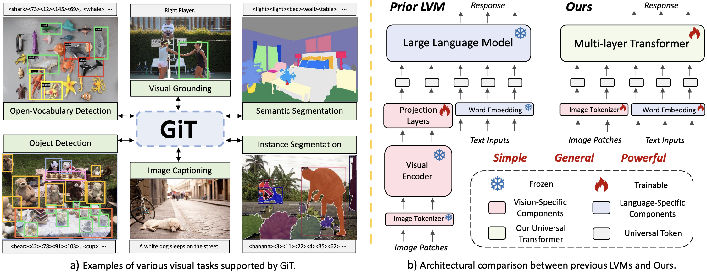
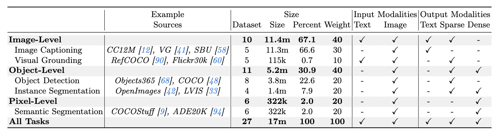

# The first GPT-style general vision model unifies various vision tasks only with a vanilla ViT. No negative transfer.
<h5 align="center">
<!-- [](https://huggingface.co/spaces/LanguageBind/GiT)
[](https://replicate.com/camenduru/GiT)
[](https://colab.research.google.com/github/camenduru/GiT-jupyter/blob/main/MoE_LLaVA_jupyter.ipynb)
[](https://huggingface.co/papers/2401.15947) -->

<!-- [](https://www.youtube.com/watch?v=uYb38g-weEY)
[](https://mp.weixin.qq.com/s/ICylR6n2LhqQRS0CAHFI1A) -->
[](https://arxiv.org/abs/2403.09394)
[](https://github.com/Haiyang-W/GiT/blob/main/LICENSE) 
[](https://hits.seeyoufarm.com)
[](https://github.com/Haiyang-W/GiT/issues?q=is%3Aopen+is%3Aissue)
[](https://github.com/Haiyang-W/GiT/issues?q=is%3Aissue+is%3Aclosed)  
[](https://twitter.com/_akhaliq/status/1768484390873477480) <br>
</h5>

This repo is the official implementation of [**ECCV2024**](https://eccv.ecva.net/) <font color=Red>**Oral**</font> paper: [GiT: Towards Generalist Vision Transformer through Universal Language Interface](https://arxiv.org/abs/2403.09394) as well as the follow-ups. We have made every effort to ensure that the codebase is clean, concise, easily readable, state-of-the-art, and relies only on minimal dependencies.

> GiT: Towards Generalist Vision Transformer through Universal Language Interface
>
> [Haiyang Wang*](https://scholar.google.com/citations?user=R3Av3IkAAAAJ&hl=en&oi=ao), [Hao Tang*](https://scholar.google.com/citations?user=MyarrsEAAAAJ&hl=en), [Li Jiang](https://scholar.google.com/citations?user=5cIodxsAAAAJ&hl=en) $^\dagger$, [Shaoshuai Shi](https://scholar.google.com/citations?user=DC9wzBgAAAAJ&hl=en&oi=ao), [Muhammad Ferjad Naeem](https://scholar.google.com/citations?user=PR2DwYYAAAAJ&hl=en), [Hongsheng Li](https://scholar.google.com/citations?user=BN2Ze-QAAAAJ&hl=en&oi=ao), [Bernt Schiele](https://scholar.google.com/citations?user=z76PBfYAAAAJ&hl=en), [Liwei Wang](https://scholar.google.com/citations?user=VZHxoh8AAAAJ&hl=en) $^\dagger$
> - Primary contact: Haiyang Wang ( wanghaiyang6@stu.pku.edu.cn ), Hao Tang ( tanghao@stu.pku.edu.cn )

<div align="center">
  
</div>

## 📣 News
- [24-8-12] 🤗 Our GiT was accepted by [ECCV2024](https://eccv.ecva.net/) with <font color=Red>**Oral**</font> presentation.
- [24-7-01] 🤗 Our GiT was accepted by [ECCV2024](https://eccv.ecva.net/).
- [24-3-15] 🚀 Training and inference Code is released.
- [24-3-15] 👀 GiT is released on [arXiv](https://arxiv.org/abs/2403.09394).

## 💫 What we want to do
### The Model Architectures across various AI domains are converging towards <font color=Red>*Multi-Layer Plain Transformers*</font>. 
- *Language Modeling* ([GPT](https://arxiv.org/abs/2005.14165))
- *2D Image Modeling* ([ViT](https://arxiv.org/abs/2010.11929))
- *3D Point Cloud Modeling* ([DSVT](https://openaccess.thecvf.com/content/CVPR2023/papers/Wang_DSVT_Dynamic_Sparse_Voxel_Transformer_With_Rotated_Sets_CVPR_2023_paper.pdf))
- *2D Image and 3D Point Cloud Joint Modeling* ([UniTR](https://arxiv.org/pdf/2308.07732))
- *Graph Modeling* ([Graphormer](https://proceedings.neurips.cc/paper/2021/file/f1c1592588411002af340cbaedd6fc33-Paper.pdf))
- $\cdot \cdot \cdot$
### Reducing Human Bias in Model Architecture Designing
We aim to unify the model architecture of vision and language through a plain transformer, **reducing human biases** such as modality-specific encoders and task-specific heads.  A key advancement in deep learning is the shift from hand-crafted to autonomously learned features, inspiring us to reduce human-designed aspects in architecture. Moreover, benefiting from the flexibility of plain transformers, our framework can extend to more modalities like [point clouds](https://github.com/Haiyang-W/UniTR) and graphs.

## 🤔 What we achieve
Building a universal computation model across all tasks stands as the cornerstone of artificial intelligence, reducing the need for task-specific designs. In this project, we introduce GiT (**G**eneralist V**i**sion **T**ransformer). GiT has the following characteristics: 
 - 😮 **Minimalist architecture design similar to LLM**: GiT consists solely of a single transformer, without the inclusion of additional vision encoders and adapters.
 - 🚀 **Covering all types of visual understanding tasks**: GiT addresses a spectrum of visual tasks, including object-level tasks (e.g., object detection), pixel-level tasks (e.g., semantic segmentation), and vision-language tasks (e.g., image captioning).
 - 🤗 **Achieving multi-task ability by unified language interface**: Similar to LLM, GiT observes the task synergy effect in multi-task training. It fosters mutual enhancement across tasks, leading to significant improvements compared to isolated training. No negative transfer phenomenon.
 - 🔥 **Strong performance on zero-shot and few-shot benchmark**: GiT scales well with model size and data, demonstrating remarkable generalizability across diverse scenarios after training on 27 datasets.
 - 👍 **Simple one-stage training strategy**: GiT uses a very simple one-stage training strategy, fully embracing the training style utilized by the current LLM framework.

## Overview
- [💫 What we want to do](https://github.com/Haiyang-W/GiT?tab=readme-ov-file#-what-we-want-to-do)
- [🤔 Introduction](https://github.com/Haiyang-W/GiT?tab=readme-ov-file#-what-we-achieve)
- [🚀 Main Results](https://github.com/Haiyang-W/GiT?tab=readme-ov-file#-main-results)
- [🛠️ Quick Start](https://github.com/Haiyang-W/GiT?tab=readme-ov-file#%EF%B8%8F-quick-start)
- [👀 Todo](https://github.com/Haiyang-W/GiT?tab=readme-ov-file#-todo)
- [👍 Acknowledgments](https://github.com/Haiyang-W/GiT?tab=readme-ov-file#-acknowledgement)
- [📘 Citation](https://github.com/Haiyang-W/GiT?tab=readme-ov-file#-citation)

## 🚀 Main Results

### Single-Task Benchmark
|  Model  |Params| Metric | Perfomance |ckpt|log|config|
|---------|---------|---------|--------|--------|---------|---------|
|  GiT-B<sub>detection</sub> | 131M|mAP|45.1 | [ckpt](https://huggingface.co/kanashi6/GiT/blob/main/det_base.pth)|[log](https://huggingface.co/kanashi6/GiT/blob/main/det_base.log)| [config](https://github.com/Haiyang-W/GiT/blob/main/configs/GiT/single_detection_base.py)|
|  GiT-B<sub>insseg</sub> | 131M|mAP|31.4 |[ckpt](https://huggingface.co/kanashi6/GiT/blob/main/insseg_base.pth)|[log](https://huggingface.co/kanashi6/GiT/blob/main/insseg_base.log)| [config](https://github.com/Haiyang-W/GiT/blob/main/configs/GiT/single_instanceseg_base.py) |
|  GiT-B<sub>semseg</sub> | 131M|mIoU|47.7 |[ckpt](https://huggingface.co/kanashi6/GiT/blob/main/semseg_base.pth)|[log](https://huggingface.co/kanashi6/GiT/blob/main/semseg_base.log)| [config](https://github.com/Haiyang-W/GiT/blob/main/configs/GiT/single_semanticseg_base.py) |
|  GiT-B<sub>caption</sub>| 131M|BLEU-4|33.7 | [ckpt](https://huggingface.co/kanashi6/GiT/blob/main/caption_base.pth)|[log](https://huggingface.co/kanashi6/GiT/blob/main/caption_base.log)| [config](https://github.com/Haiyang-W/GiT/blob/main/configs/GiT/single_caption_base.py) |
|  GiT-B<sub>grounding</sub>| 131M|Acc@0.5|83.3 | [ckpt](https://huggingface.co/kanashi6/GiT/blob/main/grounding_base.pth)|[log](https://huggingface.co/kanashi6/GiT/blob/main/grounding_base.log)| [config](https://github.com/Haiyang-W/GiT/blob/main/configs/GiT/single_visualgrounding_base.py) |
### Multi-Tasking Benchmark
|  Model  |Params| Detection | Ins Seg| Sem Seg |Caption |Grounding |ckpt|log|config|
|---------|---------|---------|--------|--------|---------|---------|---------|---------|---------|
|  GiT-B<sub>multi-task</sub> | 131M|46.7 | 31.9 | 47.8 |35.3|85.8|[ckpt](https://huggingface.co/kanashi6/GiT/blob/main/multi_base.pth)|[log](https://huggingface.co/kanashi6/GiT/blob/main/multi_base.log)| [config](https://github.com/Haiyang-W/GiT/blob/main/configs/GiT/multi_fivetask_base.py) |
|  GiT-L<sub>multi-task</sub> | 387M|51.3 | 35.1 | 50.6|35.7|88.4|[ckpt](https://huggingface.co/kanashi6/GiT/blob/main/multi_large.pth)|[log](https://huggingface.co/kanashi6/GiT/blob/main/multi_large.log)| [config](https://github.com/Haiyang-W/GiT/blob/main/configs/GiT/multi_fivetask_large.py) |
|  GiT-H<sub>multi-task</sub>| 756M|52.9 | 35.8 | 52.4|36.2|89.2|[ckpt](https://huggingface.co/kanashi6/GiT/blob/main/multi_huge.pth)|[log](https://huggingface.co/kanashi6/GiT/blob/main/multi_huge.log)| [config](https://github.com/Haiyang-W/GiT/blob/main/configs/GiT/multi_fivetask_huge.py) |
<!-- |  GiT-B<sub>single-task</sub> | 131M|45.1 | 31.4| 47.7 |33.7|83.3|[ckpt](https://huggingface.co/kanashi6/GiT/blob/main/det_base.pth)|[log](https://huggingface.co/kanashi6/GiT/blob/main/det_base.log)| [config](https://github.com/Haiyang-W/GiT/blob/main/configs/GiT/single_detection_base.py)| -->
### Task Synergy in Multi-Tasking Training
|  Model  |Params| Detection | Ins Seg| Sem Seg |Caption |Grounding |
|---------|---------|---------|--------|--------|---------|---------|
|  GiT-B<sub>single-task</sub> | 131M|45.1 | 31.4| 47.7 |33.7|83.3|
|  *Improvement* | |*+1.6* | *+0.5*| *+0.1* |*+1.6*|*+2.5*|
|  GiT-B<sub>multi-task</sub> | 131M|46.7 | 31.9 | 47.8 |35.3|85.8|
### Zero-shot benchmark
|  Model  | Params|  Cityscapes<br>(Det)|Cityscapes <br>(Ins Seg)|Cityscapes <br>(Sem Seg)|SUN RGB-D|nocaps|ckpt|log|config|
|---------|---------|---------|--------|--------|---------|---------|---------|---------|---------|
|  GiT-B<sub>multi-task</sub> |131M| 21.8 | 14.3| 34.4 | 30.9 | 9.2|[ckpt](https://huggingface.co/kanashi6/GiT/blob/main/multi_base.pth)|[log](https://huggingface.co/kanashi6/GiT/blob/main/multi_base.log)| [config](https://github.com/Haiyang-W/GiT/blob/main/configs/GiT/multi_fivetask_base.py) |
|  GiT-B<sub>universal</sub>  |131M|29.1|17.9|56.2|37.5|10.6|[ckpt](https://huggingface.co/kanashi6/GiT/blob/main/universal_base.pth)|[log](https://huggingface.co/kanashi6/GiT/blob/main/universal_base.log)| [config](https://github.com/Haiyang-W/GiT/blob/main/configs/GiT/universal_base.py) |
|  GiT-L<sub>universal</sub> |387M|32.3|20.3|58.0|39.9|11.6|[ckpt](https://huggingface.co/kanashi6/GiT/blob/main/universal_large.pth)|[log](https://huggingface.co/kanashi6/GiT/blob/main/universal_large.log)| [config](https://github.com/Haiyang-W/GiT/blob/main/configs/GiT/universal_large.py) |
|  GiT-H<sub>universal</sub> | 756M|34.1 | 18.7 | 61.8| 42.5 | 12.6|[ckpt](https://huggingface.co/kanashi6/GiT/blob/main/universal_huge.pth)|[log](https://huggingface.co/kanashi6/GiT/blob/main/universal_huge.log)| [config](https://github.com/Haiyang-W/GiT/blob/main/configs/GiT/universal_huge.py) |
### Few-shot benchmark

|  Model  | Params|DRIVE|LoveDA|Potsdam|WIDERFace|DeepFashion|config|
|---------|---------|---------|--------|--------|---------|---------|---------|
| GiT-B<sub>multi-task</sub> |131M| 34.3 | 24.9| 19.1 | 17.4 |23.0| [config](https://github.com/Haiyang-W/GiT/blob/main/configs/GiT/few-shot/few_shot_drive_base.py)|
|  GiT-B<sub>universal</sub>  |131M|51.1|30.8|30.6|31.2|38.3| [config](https://github.com/Haiyang-W/GiT/blob/main/configs/GiT/few-shot/few_shot_drive_base.py) |
|  GiT-L<sub>universal</sub> |387M|55.4|34.1|37.2|33.4|49.3| [config](https://github.com/Haiyang-W/GiT/blob/main/configs/GiT/few-shot/few_shot_drive_large.py) |
|  GiT-H<sub>universal</sub> | 756M|57.9|35.1|43.4|34.0|52.2| [config](https://github.com/Haiyang-W/GiT/blob/main/configs/GiT/few-shot/few_shot_drive_huge.py) |

## 🛠️ Quick Start
### Installation

```shell
conda create -n GiT python=3.8

conda activate GiT

# We only test in 1.9.1, may be other versions are also worked.
pip install torch==1.9.1+cu111 torchvision==0.10.1+cu111 torchaudio==0.9.1 -f https://download.pytorch.org/whl/torch_stable.html

pip install -U openmim
mim install "mmengine==0.8.3"
mim install "mmcv==2.0.1"
pip install "transformers==4.31.0"

git clone git@github.com:Haiyang-W/GiT.git
cd GiT
pip install -v -e .
pip install -r requirements/optional.txt
pip install -r requirements/runtime.txt

# if you face ChildFailedError, please update yapf
pip install yapf==0.40.1
```
- Please download pretrained text embedding from [huggingface](https://huggingface.co/kanashi6/GiT/tree/main) and organize the downloaded files as follows:
```
GiT
|──bert_embed.pt
|——bert_embed_large.pt
|——bert_embed_huge.pt
```
- (Optional) Install Java manually for image caption evaluation. Without Java, you can train image caption normally, but fail in caption evaluation.
- (Optional) Install lvis api for LVIS dataset.
```
# current path is ./GiT
cd ..
pip install git+https://github.com/lvis-dataset/lvis-api.git
```

### Dataset Preparation
#### Multi-Tasking Dataset
Multi-tasking benchmark contains coco2017 for object detection and instance segmentation, ade20k for semantic segmentation, coco caption for image caption, and refcoco series for visual grounding. 
```
GiT
|──data
|  |──ade
|  |  |──ADEChallengeData2016
|  |  |  |──annorations
|  |  |  |  |──training & validation
|  |  |  |──images
|  |  |  |  |──training & validation
|  |  |  |──objectInfo150.txt
|  |  |  |──sceneCategories.txt
|  |──coco
|  |  |──annotations
|  |  |  |──*.json
|  |  |──train2017
|  |  |  |──*.jpg
|  |  |──val2017
|  |  |  |──*.jpg
|  |──coco_2014
|  |  |──annotations
|  |  |  |──*.json
|  |  |  |──coco_karpathy_test.json
|  |  |  |──coco_karpathy_train.json
|  |  |  |──coco_karpathy_val_gt.json
|  |  |  |──coco_karpathy_val.json
|  |  |──train2014
|  |  |  |──*.jpg
|  |  |──val2014
|  |  |  |──*.jpg
|  |  |──refcoco
|  |  |  |──*.p
```

#### Universal Dataset
We use 27 datasets in universal training. For more details about dataset preparation, please refer to [here](https://github.com/Haiyang-W/GiT/blob/main/tools/dataset_preprocess/dataset_prepare.md).
<div align="center">
  
</div>
<br>

🚨 **We only list part of the commands (GiT-B) below. For more detailed commands, please refer to [here](https://github.com/Haiyang-W/GiT/blob/main/docs/en/GiT_commands.md).**

### Training
#### Single Task 
Detection

```shell
bash tools/dist_train.sh configs/GiT/single_detection_base.py  ${GPU_NUM} --work-dir ${work_dir}
```

#### Multi Task 

GiT-B

```shell
bash tools/dist_train.sh configs/GiT/multi_fivetask_base.py  ${GPU_NUM} --work-dir ${work_dir}
```

#### Universal Training

GiT-B

```shell
bash tools/dist_train.sh configs/GiT/universal_base.py  ${GPU_NUM} --work-dir ${work_dir}
```

### Testing

#### Single Task 
Detection

```shell
bash tools/dist_test.sh configs/GiT/single_detection_base.py ${ckpt_file} ${GPU_NUM} --work-dir ${work_dir}
```

#### Multi Task 

GiT-B

```shell
bash tools/dist_test.sh configs/GiT/multi_fivetask_base.py ${ckpt_file} ${GPU_NUM} --work-dir ${work_dir}
```
#### Zero-shot and few-shot
Please download universal pretrain weight from [huggingface](https://huggingface.co/kanashi6/GiT/tree/main) and organize files as follows:
```
GiT
|──universal_base.pth
|——universal_large.pth
|——universal_huge.pth
```

Zero-shot

```shell
bash tools/dist_test.sh configs/GiT/zero-shot/zero_shot_cityscapes_det_base.py ${ckpt_file} ${GPU_NUM} --work-dir ${work_dir}
```

Few-shot

```shell
bash tools/dist_train.sh configs/GiT/few-shot/few_shot_drive_det_base.py ${GPU_NUM} --work-dir ${work_dir}
```

#### Customize Dataset
If you want to use GiT on your own dataset, please refer [here](https://github.com/Haiyang-W/GiT/blob/main/docs/en/customize_dataset.md) for more details.

### 🚀 Lightweight Version
If your GPU memory is insufficient, you can reduce the resolution like [here](https://github.com/Haiyang-W/GiT/blob/main/configs/GiT/single_detection_base_672.py), where we lower the detection resolution to 672. It requires ~20 hours of training and reaches ~41.5 mAP.

## 👀 Todo

- [x] Release the [arXiv](https://arxiv.org/abs/2403.09394) version.
- [x] SOTA performance of generalist model on multi-tasking benchmark.
- [x] SOTA performance of generalist model on zero- and few-shot benchmark.
- [x] Clean up and release the inference code.
- [x] Clean up and release the training code.
- [ ] Engineering Optimization (faster).
- [ ] Joint Training including Language (stronger).
- [ ] Code Refactoring (now is also a little dirty, sorry for that).

## 👍 Acknowledgement
* [MMDetection](https://github.com/open-mmlab/mmdetection) The codebase we built upon. Thanks for providing such a convenient framework.
* [BLIP](https://github.com/salesforce/BLIP) We extract text embedding from BLIP pretrain models and use the web caption filtered by BLIP. Thanks for their efforts in open source and cleaning the dataset. 

## 📘 Citation
Please consider citing our work as follows if it is helpful.
```
@inproceedings{wang2024git,
  title={GiT: Towards Generalist Vision Transformer through Universal Language Interface},
  author={Wang, Haiyang and Tang, Hao and Jiang, Li and Shi, Shaoshuai and Naeem, Muhammad Ferjad and Li, Hongsheng and Schiele, Bernt and Wang, Liwei},
  booktitle={ECCV},
  year={2024}
}
```

## ✨ Star History
[](https://star-history.com/#Haiyang-W/GiT&Date)


<!-- ## 🤝 Contributors

<a href="https://github.com/Haiyang-W/GiT/graphs/contributors">
  
</a> -->
